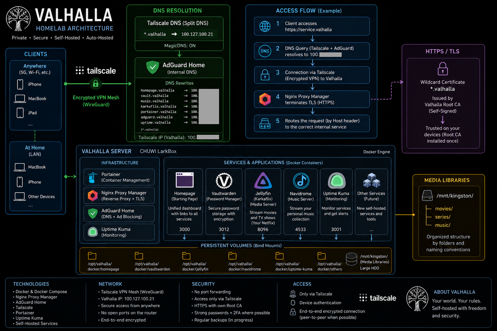

<h1 align="center">⚔️ VALHALLA ⚔️</h1>
<p align="center">A self-hosted homelab focused on privacy, simplicity, and infrastructure ownership.</p>
<h1 align="center"></h1>

## Overview

Valhalla is a personal homelab for running private services at home with Docker, internal DNS, HTTPS, and remote access through Tailscale. The goal is to keep control of data, avoid public exposure, and make everyday self-hosted tools feel approachable.

## Principles

- no public services unless strictly necessary;
- no router port forwarding;
- remote access through Tailscale;
- applications run in Docker containers;
- friendly internal names through AdGuard Home;
- centralized HTTPS with a private PKI;
- persistent data stored under `/srv`.

## What is included

The stack currently includes:

- Docker + Docker Compose;
- Nginx Proxy Manager for reverse proxy and TLS;
- AdGuard Home for internal DNS;
- Homepage as a dashboard;
- Vaultwarden for passwords;
- Jellyfin and Navidrome for media;
- Uptime Kuma for monitoring.

## Architecture at a glance

A typical request flows through local DNS, the reverse proxy, and then into the appropriate container. The full design is documented in [config/00-architecture.md](config/00-architecture.md).

## Hardware

The stack is intentionally lightweight and can run on a Raspberry Pi, a small mini PC, a NUC, or an older desktop. The full hardware notes are in [config/01-hardware.md](config/01-hardware.md).

## Documentation

The repository is organized into a set of service-specific guides:

- [config/00-architecture.md](config/00-architecture.md) — overall design
- [config/01-hardware.md](config/01-hardware.md) — hardware and network
- [config/02-os.md](config/02-os.md) — Debian host setup
- [config/03-docker.md](config/03-docker.md) — Docker and stacks
- [config/05-npm.md](config/05-npm.md) — reverse proxy
- [config/06-adguard.md](config/06-adguard.md) — DNS
- [config/07-tailscale.md](config/07-tailscale.md) — remote access
- [config/08-homepage.md](config/08-homepage.md) — dashboard
- [config/09-vaultwarden.md](config/09-vaultwarden.md) — password manager
- [config/10-jellyfin.md](config/10-jellyfin.md) — media server
- [config/11-navidrome.md](config/11-navidrome.md) — music server
- [config/12-uptime-kuma.md](config/12-uptime-kuma.md) — monitoring

## Hands on

> The docs on `config/` use neutral placeholders for security and privacy. Review them before deploying and adapt hostnames, usernames, IPs, and any service-specific values to your own environment.

### Install on a Debian-like Linux host

The easiest path is to run the installer directly:

```bash
curl -fsSL https://raw.githubusercontent.com/k4rkarov/valhalla-homelab/main/install.sh | bash
```

The installer will guide you through the setup, prepare Docker and supporting packages, create the needed directories, generate the compose configuration, and start the stack for you. During setup it will ask for a hostname, username, IP address, and an internal domain name. The default domain is `valhalla`, which is strongly recommended unless you have a specific reason to change it.

If you want to review the script first, clone the repo and run it locally:

```bash
git clone https://github.com/k4rkarov/valhalla-homelab.git
cd valhalla-homelab
./install.sh
```

Useful options:

```bash
./install.sh --help
./install.sh --check
./install.sh --dry-run --verbose
```

If you want help from an AI while installing, the repository includes [ai-context.md](ai-context.md), which summarizes the installer flow and the most important deployment details.
