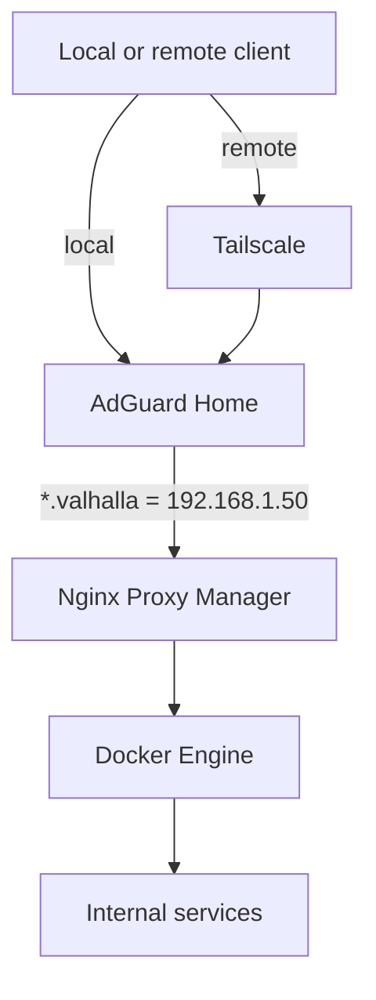

# Architecture

> High-level architecture of the **Valhalla** homelab.

---

## Purpose

This document explains how the main Valhalla components connect to each other.

Service-specific documents cover configuration, paths, ports, backups, and troubleshooting. This document keeps only the architectural decisions that apply to the whole environment.

---

## Principles

- No public services exposed directly to the Internet.
- Remote access only through Tailscale.
- Applications run in Docker containers.
- A single HTTP/HTTPS entry point: Nginx Proxy Manager.
- Internal name resolution through AdGuard Home.
- Centralized HTTPS with the `*.valhalla` wildcard certificate.
- Persistent data outside containers, mainly under `/srv`.

---

## Main Components

| Component | Role |
| --- | --- |
| Debian | Base operating system |
| Docker | Container runtime |
| Docker Compose | Stack definition |
| Portainer | Visual Docker administration |
| Nginx Proxy Manager | Reverse proxy and TLS termination |
| AdGuard Home | Internal DNS and domain blocking |
| Tailscale | Private remote access |
| Homepage | Central dashboard |
| Vaultwarden | Password manager |
| Jellyfin | Movies and series streaming |
| Navidrome | Music streaming |
| Uptime Kuma | Availability monitoring |

---

## Topology



---

## Local Flow

When the client is inside the home network:

1. The user opens `https://homepage.valhalla`.
2. The client queries AdGuard Home.
3. AdGuard returns `192.168.1.50`.
4. The browser connects to port `443` on Valhalla.
5. Nginx Proxy Manager reads the request host.
6. NPM forwards the request to the correct container.

Example:

```text
homepage.valhalla
-> 192.168.1.50
-> Nginx Proxy Manager
-> homepage:3000
```

---

## Remote Flow

When the client is outside the home network:

1. The device connects to the Tailnet.
2. Queries for the `valhalla` domain use Split DNS.
3. AdGuard Home returns the same local network IPs.
4. Tailscale uses the Subnet Router to reach `192.168.1.0/24`.
5. NPM receives the HTTPS connection and routes it to the correct container.

The user-facing address does not change:

```text
https://homepage.valhalla
```

---

## DNS

The internal domain is:

```text
valhalla
```

Local records are maintained as DNS Rewrites in AdGuard Home.

| Name | IP |
| --- | --- |
| `homepage.valhalla` | `192.168.1.50` |
| `portainer.valhalla` | `192.168.1.50` |
| `npm.valhalla` | `192.168.1.50` |
| `adguard.valhalla` | `192.168.1.50` |
| `vault.valhalla` | `192.168.1.50` |
| `karkaflix.valhalla` | `192.168.1.50` |
| `music.valhalla` | `192.168.1.50` |
| `status.valhalla` | `192.168.1.50` |

Every name points to the same server. Nginx Proxy Manager decides the final destination.

### Static IP Reservation and Internal DNS Strategy
A stable IP address is a fundamental requirement for any server running infrastructure services.
The Valhalla server uses a DHCP reservation configured on the router, ensuring that the same IP address is always assigned to the same network interface. This approach provides the benefits of a static IP while keeping network management centralized through the router's DHCP service.
A fixed IP is required because several services depend on predictable addressing, including:

- AdGuard Home
- Internal DNS records
- Nginx Proxy Manager
- Docker services
- HTTPS certificates
- Local service discovery

Enter on the router's DHCP settings and create a reservation for the Valhalla server's MAC address:

| Hostname | MAC Address | IP Address |
| --- | --- | --- |
| `valhalla` | `ee:ab:2b:9c:e4:0b` | `192.168.1.50` |

Without a reserved IP, the server address could change after a reboot or DHCP lease renewal, causing service disruptions and requiring manual updates across the environment.

---

## HTTPS

Valhalla uses a private PKI:

- CA: `Valhalla Root CA`
- Certificate: `*.valhalla`
- SANs: `*.valhalla`, `valhalla`

TLS terminates at Nginx Proxy Manager. Communication from NPM to containers can remain HTTP inside the Docker network.

```text
Client
-> HTTPS
-> Nginx Proxy Manager
-> internal HTTP
-> Container
```

All client devices must trust the `Valhalla Root CA`.

---

## Tailscale

Tailscale is used only for private access to the homelab.

Important settings:

- MagicDNS enabled.
- Split DNS for the `valhalla` domain.
- AdGuard Home advertised as the Tailnet DNS resolver.
- Subnet Router advertising `192.168.1.0/24`.
- No Exit Node by default.

With this setup, the same domains work both at home and remotely.

---

## Docker Stacks

Applications are grouped by responsibility:

| Stack | Services |
| --- | --- |
| `infra` | Homepage, Uptime Kuma |
| `proxy` | Nginx Proxy Manager |
| `network` | AdGuard Home |
| `security` | Vaultwarden |
| `media` | Jellyfin, Navidrome |

Base structure:

```text
/srv/docker
├── infra
├── proxy
├── network
├── security
└── media
```

---

## Adding a New Service

1. Create or update the container through Docker Compose.
2. Validate internal access by IP, port, or container name.
3. Create the DNS Rewrite in AdGuard Home.
4. Create the Proxy Host in Nginx Proxy Manager.
5. Attach the `*.valhalla` wildcard certificate.
6. Validate HTTPS through the service domain.
7. Add the service to Homepage.
8. Register credentials in Vaultwarden.
9. Add availability checks in Uptime Kuma.
10. Document paths, ports, backups, and troubleshooting.

---

## Security Model

The security model is based on reducing attack surface:

- No router port forwarding.
- No public services by default.
- Remote access authenticated through Tailscale.
- HTTPS for all user-facing access.
- Controlled internal DNS.
- SSH with keys.
- Persistent data covered by a backup strategy.

---

## Documentation Map

| Topic | Document |
| --- | --- |
| Overall architecture | `00-architecture.md` |
| Hardware and physical network | `01-hardware.md` |
| Operating system | `02-os.md` |
| Docker and stack organization | `03-docker.md` |
| Docker administration | `04-portainer.md` |
| Reverse proxy and certificates | `05-npm.md` |
| Internal DNS | `06-adguard.md` |
| Remote access | `07-tailscale.md` |
| Dashboard | `08-homepage.md` |
| Passwords | `09-vaultwarden.md` |
| Movies and series | `10-jellyfin.md` |
| Music | `11-navidrome.md` |
| Availability monitoring | `12-uptime-kuma.md` |
