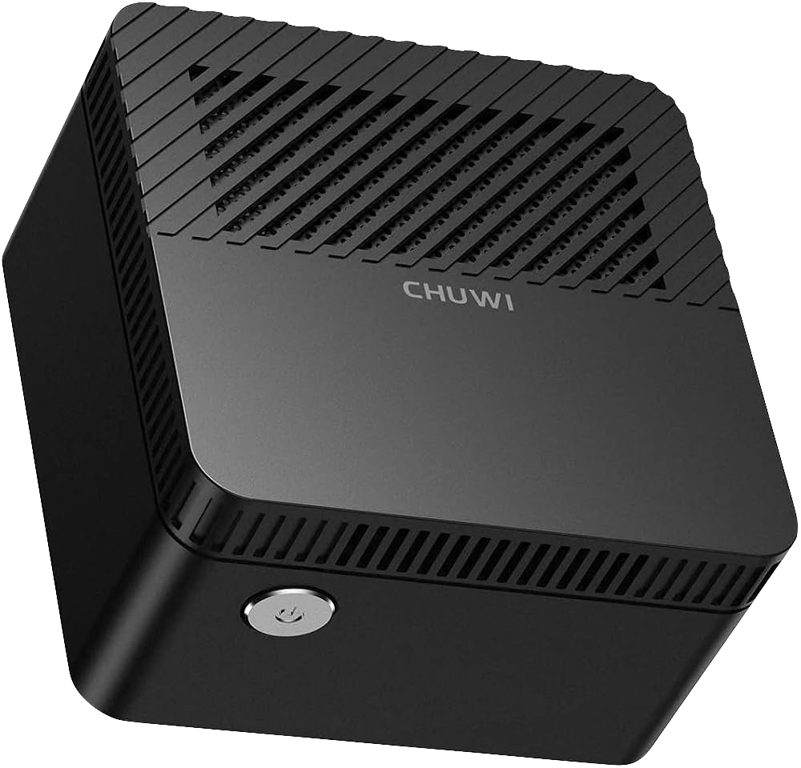

# Hardware

> Physical infrastructure documentation for the **Valhalla** homelab.

---

## Purpose

This document describes the hardware, storage, local network, and planned physical expansions used by Valhalla.

---

## Minimum Specs

The homelab can be kept intentionally small. The minimum practical hardware for this stack is:

- 64-bit Linux host;
- 2 CPU cores;
- 2 GB RAM, with 4 GB recommended;
- 16 GB of storage for the OS and Docker layer, preferably SSD-based;
- 1 Gbps network interface or better;
- external storage for media and backups if you plan to host large libraries.

This setup can run on a Raspberry Pi 4 or 5, a small mini PC, a NUC, or an old desktop. A Pi is suitable for the lighter pieces of the stack, such as DNS, reverse proxy, dashboarding, passwords, and monitoring. Media services like Jellyfin become more comfortable on a device with more RAM and faster storage, so a mini PC or NUC is usually the better long-term choice.

## Main Server

| Item | Value |
| --- | --- |
| Hostname | `valhalla` |
| Operating system | Debian 13 (Trixie) |
| Role | Docker host for the homelab services |

All Docker containers run on this machine.

---

## Hardware choice and its specs



| Item | Specification |
| --- | --- |
| Model | CHUWI LarkBox |
| CPU | Intel Celeron J4115 |
| Architecture | x86_64 |
| Memory | 6 GB LPDDR4 |
| Internal disk | 128 GB eMMC |
| Expansion | slot for SSD M.2 2242 (22 × 42 mm) SATA III (6 Gb/s) NGFF |
| Connectivity | Intel Wireless-AC 9461, 802.11ac, Bluetooth 5.0 |
| Graphics | Intel UHD Graphics 600 |
| Ports | 2x USB3.0, 1x USB-C, 1x HDMI, audio jack, MicroSD card reader |
| Weight | 127g |
| Size | 61 x 61 x 43mm (LxWxH) |


<details>
<summary>Hardware Limitations</summary>

While the homelab was built using a **Chuwi LarkBox**, these limitations may also apply to other low-cost mini PCs depending on their firmware and hardware implementation.

### USB Power in S5 (Soft Off)

One unexpected behavior is that the USB ports remain powered after the operating system has been shut down (`poweroff`).

As a result:

- External HDDs and SSDs continue receiving 5V power.
- Mechanical HDDs may continue spinning even after the server has been turned off.
- This behavior is controlled by the motherboard firmware (BIOS/Embedded Controller), **not by Linux**.

Attempts to disable USB power from the operating system were unsuccessful because, once the kernel shuts down, power management is entirely handled by the firmware. The BIOS used on the device is a generic one, and its options do not really work.

### Wake-on-LAN

The homelab was mostly made to work via Wi-Fi, mainly because the Chiwi Larkbox does't have an Ethernet port. However, an `ASIX AX88179` USB-to-Gigabit Ethernet adapter was used to investigate the existence of a WoL functionality.

The adapter itself supports Wake-on-LAN:

```text
Supports Wake-on: pg
Wake-on: g
```

However, Wake-on-LAN still does **not** function after the system is powered off.

The reason is that although the USB ports continue supplying 5V standby power, the USB controller itself is no longer active after entering the S5 power state. The Ethernet adapter loses its link, preventing it from receiving Magic Packets.

In other words:

- ✅ The Ethernet adapter supports Wake-on-LAN.
- ✅ Linux can enable Wake-on-LAN.
- ❌ The firmware does not keep the USB Ethernet adapter operational after shutdown.

This appears to be a firmware limitation rather than a Linux configuration issue.

### USB Port Power Control

The system was also tested with `uhubctl`, which can disable power on USB ports that support per-port power switching.

```bash
sudo uhubctl
```

Result:

```text
No compatible devices detected!
```

This indicates that the USB controller does not expose software-controlled port power switching.

### Practical Workaround

Because the firmware keeps USB ports powered after shutdown and does not support Wake-on-LAN through a USB Ethernet adapter, the most practical solutions are:

- Leave the server running 24/7 (recommended for always-on homelabs).
- Use a smart plug to completely remove power when the server is intentionally shut down.
- Next time choose hardware with native Ethernet, BIOS support for Wake-on-LAN, and configurable USB power management if remote power control is a requirement.
</details>

---

## Services Hosted

Currently hosted:

- Docker Engine;
- Docker Compose;
- Portainer;
- Nginx Proxy Manager;
- Homepage;
- AdGuard Home;
- Vaultwarden;
- Jellyfin;
- Navidrome;
- Uptime Kuma;
- Tailscale.

Potential future services:

- Grafana;
- Loki;
- Prometheus;
- Paperless-ngx;
- Immich;
- VPS tunnel.

---

## Storage Layout

Current base structure:

```text
/
└── srv
    ├── docker
    ├── media
    ├── backups
    └── certificates
```

Media layout:

```text
/srv/media
├── movies
├── series
└── music
```

---

## Planned Storage Expansion

A dedicated M.2 SSD (or HDD) is planned for:

- Jellyfin media;
- Navidrome music;
- backups;
- snapshots.

Goals:

- better performance;
- less wear on eMMC storage;
- easier migration.

---

## Local Network

| Item | Value |
| --- | --- |
| Network | `192.168.1.0/24` |
| Gateway | `192.168.1.1` |
| Server IP | `192.168.1.50` |
| Internal DNS | AdGuard Home |

---

## Tailnet

The server is part of a Tailscale Tailnet.

Main uses:

- remote administration;
- SSH;
- remote DNS;
- Subnet Router;
- private HTTPS access.

Valhalla advertises:

```text
192.168.1.0/24
```

This lets Tailscale clients access local network services while away from home.

---

## Power

The server is intended to run continuously.

Goals:

- high availability;
- continuous synchronization;
- media access at any time.

Future recommendation:

- add a UPS to protect against outages and abrupt shutdowns.

---

## Administration

Valhalla is administered through:

- SSH;
- Portainer;
- Homepage;
- Tailscale SSH, if enabled.

Daily administration is primarily done from the Linux terminal. Web interfaces are used when they make routine tasks easier.

---

## Monitoring

Basic host checks:

```bash
top
free -h
df -h
sensors
docker ps
docker stats
ss -tulpn
journalctl
```

Service availability is monitored by Uptime Kuma.

---

## Hardware Philosophy

The hardware strategy favors:

- simplicity;
- low power usage;
- high availability;
- easy recovery;
- complete documentation;
- minimal maintenance;
- free and open source software when possible.

---

## Roadmap

- Dedicated NVMe SSD;
- UPS;
- second backup server;
- VPS access layer;
- automated backups;
- periodic snapshots;
- distributed monitoring.
